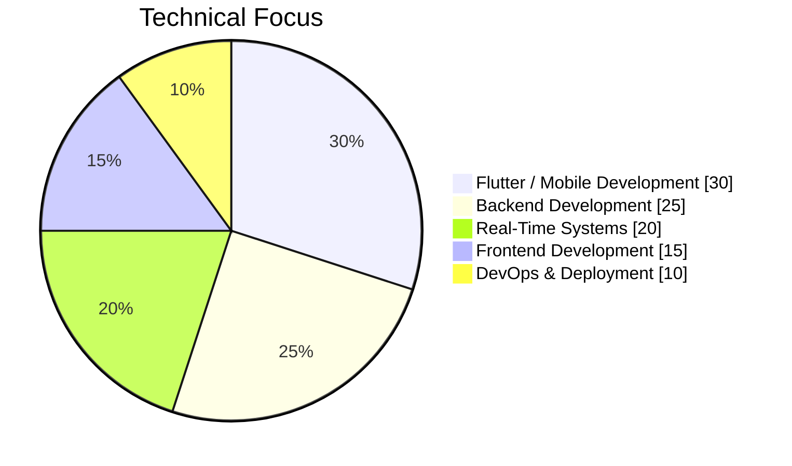
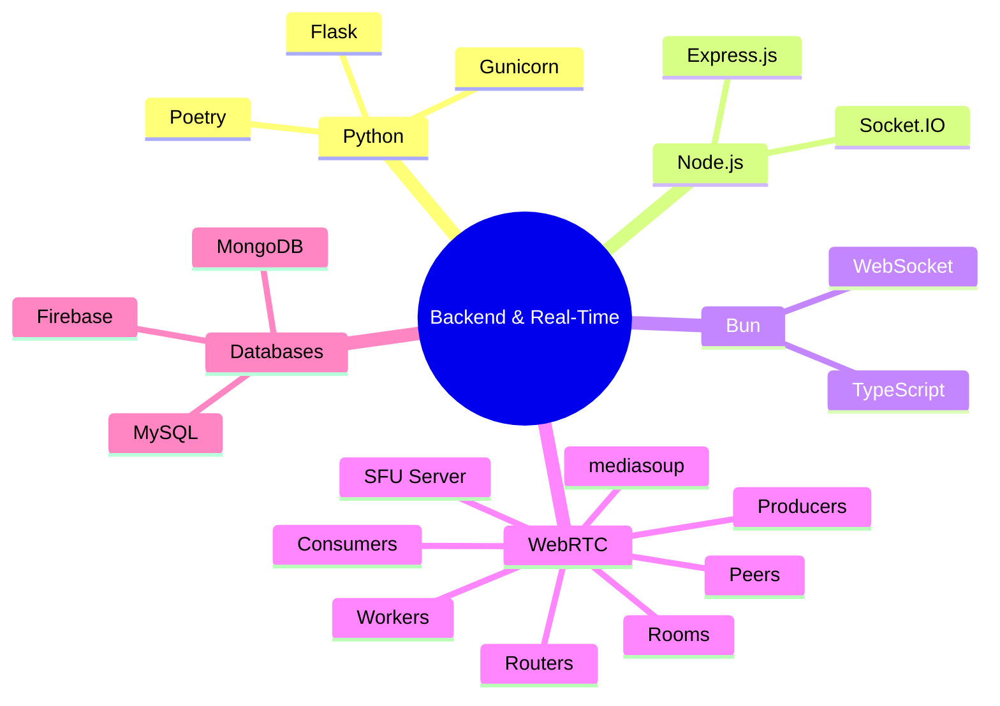
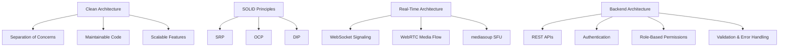
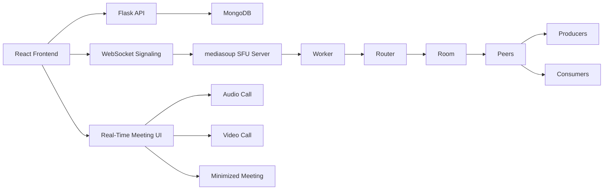
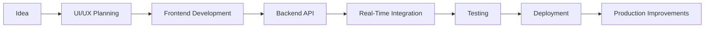

<div align="center">


<br />

<p>
  
  
  
</p>

### Full-Stack Mobile Developer · Flutter Specialist · Real-Time Systems Builder

I build **mobile-first**, **real-time**, and **scalable applications** using Flutter, modern backend technologies, WebSocket systems, WebRTC, and SFU video infrastructure.

<br />

[](mailto:beyremagrebi58@gmail.com)
[](https://linkedin.com/in/beyrem-agrebi)
[](https://github.com/beyremagrebi)

</div>

---

## 🧩 Who I Am

<table>
  <tr>
    <td width="33%">
      <h3 align="center">📱 Mobile</h3>
      <p align="center">Flutter apps with clean architecture, MVVM, Firebase, APIs, and smooth UX.</p>
    </td>
    <td width="33%">
      <h3 align="center">🧠 Backend</h3>
      <p align="center">Python, Flask, Node.js, Bun, Spring Boot, Laravel, REST APIs, auth, and databases.</p>
    </td>
    <td width="33%">
      <h3 align="center">⚡ Real-Time</h3>
      <p align="center">WebSocket, Socket.IO, WebRTC, mediasoup SFU, rooms, peers, producers, consumers.</p>
    </td>
  </tr>
</table>

```txt
Role        Full-Stack Mobile Developer
Focus       Flutter · Backend APIs · Real-Time Systems · WebRTC SFU
Strength    Building complete products from frontend to backend
Mindset     Clean architecture, scalable systems, and professional UI/UX
```

---

## 🚀 What I Build

* Cross-platform mobile applications with **Flutter**
* Scalable backend APIs with **Python Flask**, **Node.js**, **Bun**, **Spring Boot**, and **Laravel**
* Real-time chat and collaboration systems
* WebSocket and Socket.IO communication flows
* Audio/video meetings using **WebRTC + mediasoup SFU**
* Slack-like collaboration platforms with teams, channels, roles, and permissions
* Clean dashboards, responsive interfaces, and production-ready workflows

---

## 📊 Technical Focus



---

## 🛠 Tech Stack

### 📱 Mobile Development

<p>
  
  
  
</p>

### 🎨 Frontend Development

<p>
  
  
  
  
  
</p>

### 🧠 Backend Development

<p>
  
  
  
  
</p>

<p>
  
  
  
  
  
  
  
</p>

### ⚡ Real-Time & Video Systems

<p>
  
  
  
  
</p>

### 🗄 Databases & Infrastructure

<p>
  
  
  
</p>

<p>
  
  
  
  
  
</p>

---

## 🧠 Backend & Real-Time Expertise



---

## 🏗 Architecture & Engineering Principles



---

# 🚀 Featured Projects

## 💬 Combo App — Slack-Like Collaboration Platform

A modern team collaboration platform inspired by Slack, built with teams, channels, members, permissions, real-time meetings, and a custom SFU video infrastructure.

```txt
Frontend      React · Vite · TailwindCSS
Backend       Python · Flask · Poetry · MongoDB
Real-Time     WebSocket · WebRTC · mediasoup
SFU Server    Bun · TypeScript · mediasoup
Deployment    Render · Gunicorn
```

### Main Features

* Team workspace management
* Public and private channels
* Add members to private channels
* Member search and selection
* Invite members by email
* Role and permission system
* Kick one or multiple members
* Join request management
* Responsive workspace UI
* Audio and video calls per channel
* Minimized meeting window
* Meeting restore system
* Active meeting persistence
* Real-time participant display
* User metadata in video meetings
* Flask backend with Poetry
* MongoDB data modeling
* Render deployment preparation

---

## 🎥 mediasoup SFU Server

A custom SFU server built for scalable real-time audio and video communication.

```txt
Runtime       Bun
Language      TypeScript
Media Server  mediasoup
Protocol      WebRTC
Signaling     WebSocket
```

### Main Features

* Worker initialization
* Router creation
* Room management
* Peer management
* WebRTC transport creation
* Producer handling
* Consumer handling
* Existing peers synchronization
* Peer joined events
* Peer left events
* New producer notifications
* Audio/video stream routing
* Participant metadata exchange
* Scalable SFU meeting foundation

---

## 🧭 Combo App Architecture



---

## 🎓 Educational App — Full-Stack Learning Platform

[GitHub Repository](https://github.com/beyremagrebi/udemy-app-mobile)

```txt
Mobile     Flutter · Dart
Backend    Node.js · Express.js · Go
Real-Time  Socket.IO
```

### Main Features

* Course content management
* Video, PDF, Word, and Excel support
* Real-time chat
* Video calls with Jitsi Meet
* Auto-update system
* Integrated video player
* 45+ customizable themes
* Mobile-first experience

---

## 📄 CVTech Platform — Social Network & CV Builder

[GitHub Repository](https://github.com/beyremagrebi/redit-clone)

### Main Features

* Professional user profiles
* LinkedIn-like profile system
* Real-time feed
* CV generation for French and Canadian markets
* Social interaction features
* Career-oriented user experience

---

## 🖥 Bun Backend API

[GitHub Repository](https://github.com/beyremagrebi/bun-server)

### Main Features

* Secure authentication
* SendGrid email integration
* CRUD APIs
* Validation and error handling
* Clean REST structure
* Modular backend architecture

---

## 🛍 Swap Shop — E-Commerce Platform

```txt
Frontend   Angular
Backend    Node.js · Spring Boot
Mobile     Kotlin
```

### Main Features

* Product browsing
* Cart and favorites
* Admin management
* E-commerce workflow
* Multi-stack collaboration

---

## 🎓 Scholarship Management System

[GitHub Repository](https://github.com/beyremagrebi/SpringbootProject.git)

```txt
Backend  Spring Boot
View     JSP
```

### Main Features

* Submit scholarship applications
* Track application status
* Manage student requests
* Admin-side application handling

---

# 🔁 Development Workflow



---

# 💼 Experience

## Team Lead Mobile — Proservices Training

**06/2024 – Present | Ariana, Tunisia**

* Leading 4 interns and coordinating with backend and UI teams
* Delivered production-ready Flutter applications
* Integrated mobile apps with Node.js and Go backend services
* Implemented GitFlow, code reviews, and best practices
* Mentored junior developers
* Worked on real-time communication features
* Improved development workflow and team collaboration

---

## Full-Stack Developer Intern — Proservices Training

**01/2024 – 05/2024 | Ariana, Tunisia**

* Built a cross-platform Flutter application
* Integrated Node.js backend services
* Developed real-time features with Socket.IO
* Applied MVVM architecture
* Optimized mobile performance
* Integrated Firebase services
* Worked with Agile workflow, sprints, and code reviews

---

## Web Developer Intern — Elitinfo

**07/2022 – 09/2022 | Urbain Nord, Tunisia**

* Developed a complete web application using Vue.js and Laravel
* Worked on UI implementation
* Built and integrated backend APIs
* Participated in testing and feature development

---

# 🎓 Education

## Engineering Cycle in Computer Science

**Université SESAME | 2024 – Present**

## Bachelor’s Degree in Information Systems Development

**ISET Bizerte | 2021 – 2024**

---

# 🌐 Languages

| Language | Level        |
| -------- | ------------ |
| Arabic   | Native       |
| French   | Intermediate |
| English  | Intermediate |

---

# 📊 GitHub Activity

<div align="center">


</div>

<br />

<div align="center">


</div>

<br />

<div align="center">


</div>

---

# 🏆 GitHub Achievements

<div align="center">


</div>

---

# 📫 Contact

<div align="center">

[](mailto:beyremagrebi58@gmail.com)

[](https://linkedin.com/in/beyrem-agrebi)

[](https://github.com/beyremagrebi)

</div>

---

<div align="center">

## Code with passion. Build with structure. Deliver with impact.

</div>
